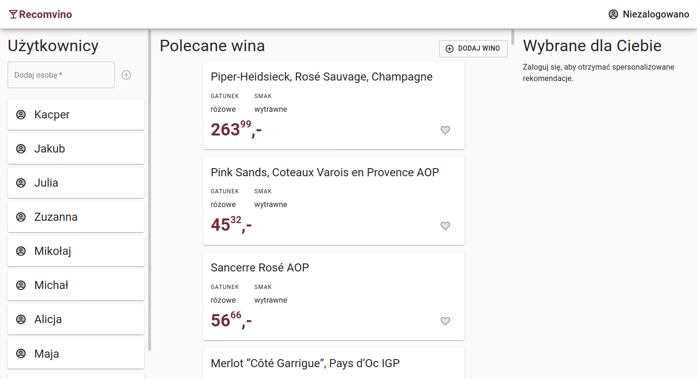

# recomvino-fe
Aplikacja rekomendująca wina na podstawie polubień użytkownika.

### Autor: Kacper Kapuściak

Projekt zrealizowany został z wykorzystaniem technologi `React` w języku `Typescript`. Do uruchomienia projektu lokalnie wymagane jest środowisko uruchomieniowe `Node.js` w wersji `12` lub wyższej. Projekt został umieszczony na platformie `Heroku`.

Link do projektu: [recomvino.herokuapp.com](https://recomvino.herokuapp.com/)

## Skrypty

| Skrypt        | Opis                                      |
| ------------- | ----------------------------------------- |
| `npm start`   | uruchamia aplikacje w trybie developmentu |
| `npm run build` | przygotowuje build produkcyjny |

## Struktura projektu

```
├── package.json
├── public
│   ├── favicon.ico
│   └── index.html
├── README.md
├── src
│   ├── api
│   │   ├── functions
│   │   │   ├── addLike.ts
│   │   │   ├── addPerson.ts
│   │   │   ├── addWine.ts
│   │   │   ├── getLikes.ts
│   │   │   ├── getPeople.ts
│   │   │   ├── getPerson.ts
│   │   │   ├── getRecommendations.ts
│   │   │   ├── getWines.ts
│   │   │   ├── getWine.ts
│   │   │   ├── index.ts
│   │   │   └── removeLike.ts
│   │   ├── index.ts
│   │   └── instance.ts
│   ├── App.tsx
│   ├── components
│   │   ├── index.ts
│   │   ├── people
│   │   │   ├── AddPerson.tsx
│   │   │   ├── PeoplePanel.tsx
│   │   │   └── PersonCard.tsx
│   │   ├── recommendations
│   │   │   ├── RecommendationsPanel.tsx
│   │   │   └── Recommendation.tsx
│   │   ├── ui
│   │   │   ├── Detail.tsx
│   │   │   ├── Layout.tsx
│   │   │   ├── Logo.tsx
│   │   │   ├── NavBar.tsx
│   │   │   ├── Panel.tsx
│   │   │   └── Spinner.tsx
│   │   └── wine
│   │       ├── AddWine.tsx
│   │       ├── Price.tsx
│   │       ├── WineCard.tsx
│   │       └── WinePanel.tsx
│   ├── index.tsx
│   ├── providers
│   │   └── UserProvider.tsx
│   └── types
│       ├── IFavoriteWine.ts
│       ├── ILikeDto.ts
│       ├── ILike.ts
│       ├── index.ts
│       ├── IPerson.ts
│       ├── IRecommendation.ts
│       ├── IUserContext.ts
│       └── IWine.ts
├── tsconfig.json
└── yarn.lock
```

## Interfejs

Interfejs podzielony jest na trzy panele - panel użytkowników, win oraz rekomendacji. 


Żeby móc dodać wino do ulubionych trzeba być zalogowanym użytkownikiem.
Logowanie odbywa się poprzez kliknięcie na imię użytkownika po lewej stronie. Aby się wylogować należy kliknąć w prawym górnym rogu na zalogowanego użytkownika.

Na środkowym panelu znajdują się wszystkie wina dostępne w bazie. Każde z win posiada nazwę, gatunek, smak oraz cenę. Na panelu dostępny jest także przycisk  dodawania nowego wina.


Zalogowany użytkownik posiadający ulubione wina otrzyma rekomendacje na podstawie gatunku oraz smaku wina (polubienie różowego, wytrawnego wina skutkuje rekomendacją większej ilości różowych, wytrawnych win).


